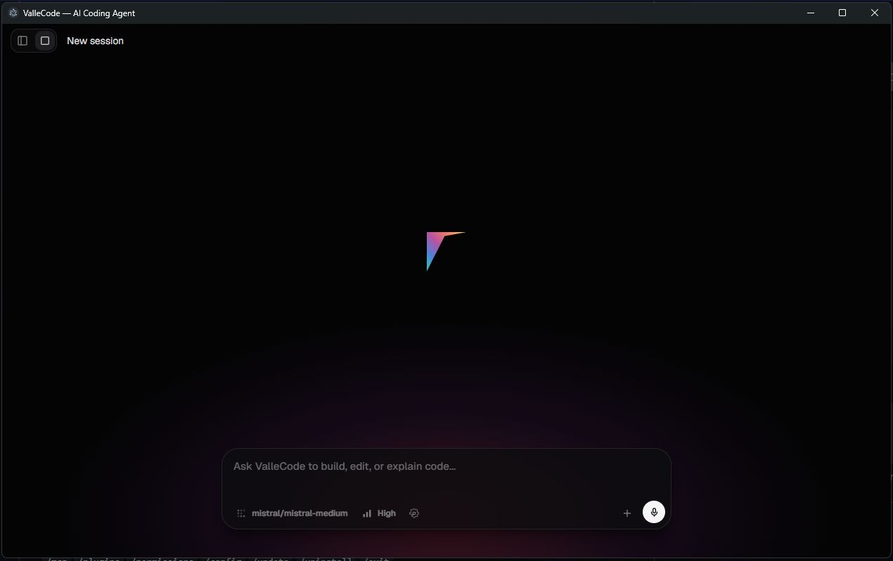

# ValleCode (SOURCE CODE NOT PUBLISHED YET)

AI-powered coding agent with a modern Electron desktop interface. Combines a Rick CLI backend (Go) with a Next.js/Electron frontend for an autonomous code editing experience.



## Features

- **Rick CLI Engine** — Full agent loop (tool calling, context management, compaction) powered by [Rick](https://github.com/rick-cli/rick)
- **41 AI Providers** — Anthropic, OpenAI, Google, Mistral, DeepSeek, xAI Grok, Kimi, Qwen, Groq, Together, Perplexity, Ollama, and more
- **Context Meter** — Real-time token usage tracking with circular progress indicator
- **Project Management** — Organize sessions into projects with git-backed undo/redo
- **Voice Input** — Speech-to-text with audio visualizer
- **Image Attachments** — Paste screenshots for vision-capable models
- **Plan & Build Modes** — Toggle between read-only planning and full execution
- **Encrypted Key Storage** — API keys stored via OS safeStorage
- **Permission System** — Allow/ask/deny per tool call (routed from Rick daemon)

## Architecture

```
┌─────────────────────────────────────────────┐
│  Electron Renderer (Next.js + React)        │
│  ┌─────────┐ ┌──────────┐ ┌──────────────┐ │
│  │ Sidebar │ │  Chat    │ │ Context Meter│ │
│  │Projects │ │ Composer │ │   (tokens)   ││
│  └─────────┘ └──────────┘ └──────────────┘ │
└────────────────────┬────────────────────────┘
                     │ IPC (contextBridge)
┌────────────────────┴────────────────────────┐
│  Electron Main Process (Node.js)            │
│  ┌──────────────┐  ┌─────────────────────┐  │
│  │ preload.cjs  │  │  rick-engine.cjs    │  │
│  │  (API bridge)│  │ (spawn rickserve)   │  │
│  └──────────────┘  └────────┬────────────┘  │
└─────────────────────────────┬───────────────┘
                              │ stdin/stdout (ndjson)
┌─────────────────────────────┴───────────────┐
│  Rick Daemon (Go subprocess)                │
│  ┌─────────┐ ┌────────┐ ┌───────────────┐  │
│  │ Agent   │ │ Tools  │ │ 41 Providers  │  │
│  │ Loop    │ │(bash,  │ │ (anthropic,   │  │
│  │         │ │ read,  │ │  openai, ...) │  │
│  │         │ │ edit)  │ │               │  │
│  └─────────┘ └────────┘ └───────────────┘  │
└─────────────────────────────────────────────┘
```

## Tech Stack

| Layer | Technology |
|-------|-----------|
| Frontend | Next.js 14, React 18, Tailwind CSS |
| Desktop | Electron 31 |
| Backend | Rick CLI (Go) as ndjson daemon |
| Storage | Encrypted JSON (safeStorage) |
| Icons | Lucide React |

## Getting Started

### Prerequisites
- Node.js 18+
- Go 1.24+ (for building Rick)
- pnpm

### Install & Run

```bash
# Install dependencies
pnpm install

# Build Rick backend (first time)
cd go/rick
go build -o ../rick.exe ./cmd/rick
go build -o ../rickserve.exe ./cmd/rickserve
cd ../..

# Development mode
pnpm dev

# Production build + launch
pnpm build
./launch.bat
```

## Provider Configuration

API keys are stored encrypted at `%APPDATA%\ValleCode\keys.json`. Configure providers in **Settings → Models**.

| Provider | Auth | Base URL |
|----------|------|----------|
| Anthropic | `ANTHROPIC_API_KEY` | `api.anthropic.com` |
| OpenAI | `OPENAI_API_KEY` | `api.openai.com` |
| OpenRouter | `OPENROUTER_API_KEY` | `openrouter.ai/api/v1` |
| Google | `GEMINI_API_KEY` | `generativelanguage.googleapis.com` |
| Mistral | `MISTRAL_API_KEY` | `api.mistral.ai/v1` |
| DeepSeek | `DEEPSEEK_API_KEY` | `api.deepseek.com/v1` |
| xAI Grok | `XAI_API_KEY` | `api.x.ai/v1` |
| Kimi | `KIMI_API_KEY` | `api.moonshot.ai/v1` |
| Ollama | none | `localhost:11434` |

## Rick Daemon Protocol (ndjson)

ValleCode communicates with Rick via newline-delimited JSON:

**Request:**
```json
{"type":"run","session_id":"abc","prompt":"fix the bug","model":"anthropic/claude-sonnet-4-5"}
```

**Events (streaming):**
```json
{"type":"event","event":"Content","data":{"text":"..."}}
{"type":"event","event":"ToolUse","data":{"name":"bash","input":{"command":"ls"}}}
{"type":"event","event":"ToolResult","data":{"name":"bash","output":"..."}}
{"type":"event","event":"Usage","data":{"input_tokens":100,"output_tokens":50}}
{"type":"done","session_id":"abc"}
```

## Project Structure

```
ValleCode/
├── app/                      # Next.js renderer
│   ├── page.tsx              # Main layout
│   └── globals.css           # Theme variables
├── components/
│   ├── app-sidebar.tsx       # Project/session sidebar
│   ├── chat-view.tsx         # Chat display
│   ├── composer.tsx          # Input area (voice, attachments)
│   ├── context-meter.tsx     # Token usage circle
│   ├── settings-dialog.tsx   # Models & providers config
│   └── top-bar.tsx           # Header with controls
├── electron/
│   ├── main.cjs              # Main process + IPC
│   ├── preload.cjs           # contextBridge API
│   ├── agent.cjs             # Legacy agent (being replaced by Rick)
│   └── prompts.cjs           # System prompts
├── go/
│   └── rick/                 # Rick CLI source (forked)
└── launch.bat                # Production launcher
```

## License

MIT
